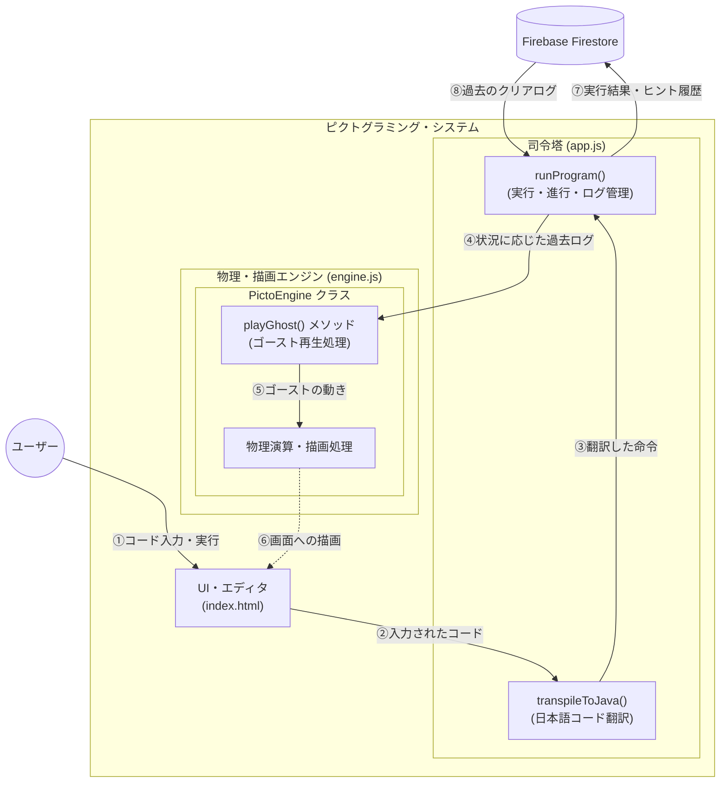

# スライド発表用 システム簡易構成図

スライドに載せるのに最適な、要素を絞ったシンプルな構成図です。
以下のMermaidコードをコピーして、**Draw.io（app.diagrams.net）の「配置 > 挿入 > 高度な機能 > Mermaid」**に貼り付けることで、そのまま図形として取り込むことができます。

```mermaid
graph TD
    %% 外部サービス
    Firestore[(Firebase Firestore)]

    %% ブラウザ（システム内部）
    subgraph Browser ["ピクトグラミング・システム"]
        UI["UI・エディタ<br>(index.html)"]
        
        subgraph AppJS ["司令塔 (app.js)"]
            Transpile["transpileToJava()<br>(日本語コード翻訳)"]
            Run["runProgram()<br>(実行・進行・ログ管理)"]
        end
        
        subgraph EngineJS ["物理・描画エンジン (engine.js)"]
            subgraph PictoClass ["PictoEngine クラス"]
                Engine["物理演算・描画処理"]
                Ghost["playGhost() メソッド<br>(ゴースト再生処理)"]
            end
        end
    end

    %% データの流れ
    User(("ユーザー")) -- "①コード入力・実行" --> UI
    UI -- "②入力されたコード" --> Transpile
    Transpile -- "③翻訳した命令" --> Run
    Run -- "④状況に応じた過去ログ" --> Ghost
    Ghost -- "⑤ゴーストの動き" --> Engine
    Engine -. "⑥画面への描画" .-> UI
    
    Run -- "⑦実行結果・ヒント履歴" --> Firestore
    Firestore -- "⑧過去のクリアログ" --> Run
```
